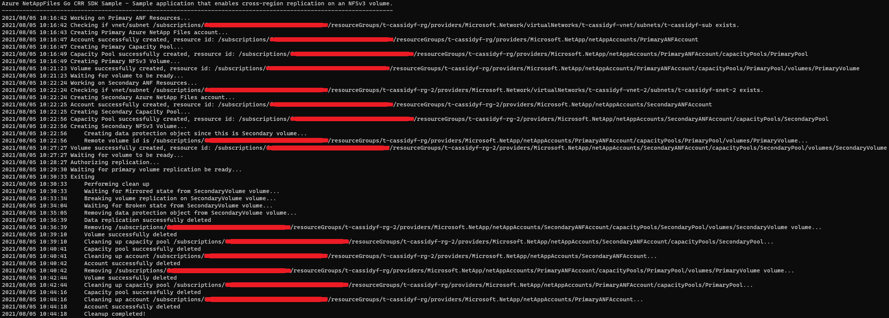

# Azure NetAppFiles CRR SDK Sample for Go

This sample demonstrates how to enable Cross-Region Replication (CRR) on NFSv3 Volume using Azure Go SDK for Microsoft.NetApp resource provider. This process is identical for NFS v4.1 Volumes with exception of protocol type used.

In this sample application we perform the following operations:

* Creation
  * Primary ANF Account
    * Primary Capacity pool
      * Primary NFS v3 Volume
  * Secondary ANF Account
    * Secondary Capacity pool
      * Secondary NFS v3 Data Replication Volume with reference to the primary volume Resource ID
* Authorize primary volume with secondary volume Resource ID
* Clean up created resources (not enabled by default)

If you don't already have a Microsoft Azure subscription, you can get a FREE trial account [here](http://go.microsoft.com/fwlink/?LinkId=330212).

## Prerequisites

1. Go installed \(if not installed yet, follow the [official instructions](https://golang.org/dl/)\)
1. Azure Subscription
1. Subscription needs to be enabled for Azure NetApp Files. For more information, please refer to [this](https://docs.microsoft.com/azure/azure-netapp-files/azure-netapp-files-register#waitlist) document.
1. (Valid only until CRR is in preview state) Request preview access for Azure NetApp Files cross-region replication. For more information, please refer to [this](https://docs.microsoft.com/en-us/azure/azure-netapp-files/cross-region-replication-create-peering) document.
1. Resource Group(s) created
1. Virtual Networks (both for primary and secondary volumes) with a delegated subnet to Microsoft.Netapp/volumes resource. For more information, please refer to [Guidelines for Azure NetApp Files network planning](https://docs.microsoft.com/en-us/azure/azure-netapp-files/azure-netapp-files-network-topologies)
1. Adjust variable contents within `var()` block at `example.go` file to match your environment
1. For this sample Go console application work, we need to authenticate and the chosen method for this sample is using service principals:
    * Within an [Azure Cloud Shell](https://docs.microsoft.com/en-us/azure/cloud-shell/quickstart) session, make sure you're logged on at the subscription where you want to be associated with the service principal by default

      ```bash
      az account show
      ```

      If this is not the correct subscription, use

      ```bash
      az account set -s <subscription name or id>  
      ```

    * Create a service principal using Azure CLI

      ```bash
      az ad sp create-for-rbac --sdk-auth
      ```

      >Note: this command will automatically assign RBAC contributor role to the service principal at subscription level, you can narrow down the scope to the specific resource group where your tests will create the resources.

    * Copy the output content and paste it in a file called azureauth.json and secure it with file system permissions (make sure it is not inside of any repo)
    * Set an environment variable pointing to the file path you just created, here is an example with Powershell and bash:

      Powershell

      ```powershell
      [Environment]::SetEnvironmentVariable("AZURE_AUTH_LOCATION", "C:\sdksample\azureauth.json", "User")
      ```

      Bash

      ```bash
      export AZURE_AUTH_LOCATION=/sdksamples/azureauth.json
      ```

    >Note: for other Azure Active Directory authentication methods for Go, please refer to [Authentication methods in the Azure SDK for Go](https://docs.microsoft.com/en-us/azure/go/azure-sdk-go-authorization).

## What is example.go doing

This sample project is focused on demonstrating how to enable cross-region replication in Azure NetApp Files for an NFSv3 enabled volume (note that this process is the same for NFSv4.1 volumes), similar to other examples, the authentication method is based on a service principal, this project will create two ANF Accounts in different regions with capacity pool. A single volume using Premium service level tier as the Primary ANF, and Standard service level tier in the secondary region with Data Protection object.

I summary, the process of enabling Cross-Region replication, we can describe it as creating the primary resources, including primary volume, then we move forward and create the secondary resources but with the difference that in the secondary volume, it needs to contain the Data Replication Object, after this is complete, as a last step, we authorize the replication from the primary volume referencing the resource id of the secondary volume.

In addition, we use some non-sensitive information from the *file-based authentication* file that in the initial stages we get the subscription ID and this is used for the test we perform to check if the subnets provided exists before starting creating any ANF resources, failing execution if they're missing.

Authentication is made on each operation where we obtain an authorizer to pass to each client we instantiate (in Azure Go SDK for NetAppFiles each resource has its own client). For more information about the authentication process used, refer to [Use file-based authentication](https://docs.microsoft.com/en-us/azure/go/azure-sdk-go-authorization#use-file-based-authentication) section of [Authentication methods in the Azure SDK for Go](https://docs.microsoft.com/en-us/azure/go/azure-sdk-go-authorization) document.

Lastly, the clean up process takes place (not enabled by default, please change variable `shouldCleanUp` to `true` at `example.go` file `vaa()` section if you want clean up), deleting all resources in the reverse order following the hierarchy otherwise we can't remove resources that have nested resources. Related to CRR, before removing the secondary volume, we need to remove data replication object on it before deleting the volume. If there is an error during the application execution, clean up does not take place and you will need to manually perform this task.
You will notice that the clean up process uses a function called `WaitForNoANFResource` while other parts of the code uses `WaitForANFResource`, at this moment this is required so we can workaround a current ARM behavior of reporting that the object was deleted when in fact its deletion is still in progress, similarly, stating the the volume is fully created while this is still finishing up. Also, we will see some functions called `GetAnf<resource type>`, these were created in this sample to be able to get the name of the resource without its hierarchy represented in the `<resource type>.name` property, which cannot be used directly in other methods of Azure NetApp Files client like `get`.

>Note: Please refer to [Resource limits for Azure NetApp Files](https://docs.microsoft.com/en-us/azure/azure-netapp-files/azure-netapp-files-resource-limits) to understand ANF's most current limits.

## Contents

| File/folder                 | Description                                                                                                      |
|-----------------------------|------------------------------------------------------------------------------------------------------------------|
| `media\`                       | Folder that contains screenshots.                                                                                              |
| `netappfiles-go-crr-sdk-sample\`                       | Sample source code folder.                                                                                              |
| `netappfiles-go-crr-sdk-sample\example.go`            | Sample main file.                                                                                                |
| `netappfiles-go-crr-sdk-sample\go.mod`            |The go.mod file defines the module’s module path, which is also the import path used for the root directory, and its dependency requirements, which are the other modules needed for a successful build.|
| `netappfiles-go-crr-sdk-sample\go.sum`            | The go.sum file contains hashes for each of the modules and it's versions used in this sample|
| `netappfiles-go-crr-sdk-sample\internal\`       | Folder that contains all internal packages dedicated to this sample.                |
| `netappfiles-go-crr-sdk-sample\internal\iam\iam.go` | Package that allows us to get the `authorizer` object from Azure Active Directory by using the `NewAuthorizerFromFile` function. |
| `netappfiles-go-crr-sdk-sample\internal\models\models.go`       | Provides models for this sample, e.g. `AzureAuthInfo` models the authorization file.                   |
| `netappfiles-go-crr-sdk-sample\internal\sdkutils\sdkutils.go`       | Contains all functions that directly uses the SDK and some helper functions.                   |
| `netappfiles-go-crr-sdk-sample\internal\uri\uri.go`       | Provides various functions to parse resource IDs and get information or perform validations.                   |
| `netappfiles-go-crr-sdk-sample\internal\utils\utils.go`       | Provides generic functions.                   |
| `.gitignore`                | Define what to ignore at commit time.                                                                            |
| `CHANGELOG.md`              | List of changes to the sample.                                                                                   |
| `CONTRIBUTING.md`           | Guidelines for contributing to the sample.                                                                       |
| `README.md`                 | This README file.                                                                                                |
| `LICENSE`                   | The license for the sample.                                                                                      |
| `CODE_OF_CONDUCT.md`        | Microsoft's Open Source Code of Conduct.                                                                         |

## How to run

1. Go to your GOPATH folder and create the following path
    ```powershell
    # PowerShell example
    cd $env:GOPATH/src
    mkdir ./github.com/Azure-Samples
    ```

    ```bash
    # Bash example
    cd $GOPATH/src
    mkdir -p ./github.com/Azure-Samples
    ```
2. Clone it locally
    ```bash
    cd github.com/Azure-Samples
    git clone https://github.com/Azure-Samples/netappfiles-go-crr-sdk-sample.git
    ```
3. Change folder to **netappfiles-go-crr-sdk-sample/netappfiles-go-crr-sdk-sample**
    ```bash
    cd netappfiles-go-crr-sdk-sample/netappfiles-go-crr-sdk-sample
    ```
4. Make sure you have the `azureauth.json` and its environment variable with the path to it defined (as previously described at [prerequisites](#Prerequisites))
6. Edit file **example.go** `var()` block and change the variables contents as appropriate (names are self-explanatory).
7. Run the sample
    ```bash
    go run .
    ```

Sample output


## References

* [Cross-region replication of Azure NetApp Files volumes](https://docs.microsoft.com/en-us/azure/azure-netapp-files/cross-region-replication-introduction)
* [Authentication methods in the Azure SDK for Go](https://docs.microsoft.com/en-us/azure/go/azure-sdk-go-authorization)
* [Azure SDK for Go Samples](https://github.com/Azure-Samples/azure-sdk-for-go-samples) - contains other resource types samples
* [Resource limits for Azure NetApp Files](https://docs.microsoft.com/en-us/azure/azure-netapp-files/azure-netapp-files-resource-limits)
* [Azure Cloud Shell](https://docs.microsoft.com/en-us/azure/cloud-shell/quickstart)
* [Azure NetApp Files documentation](https://docs.microsoft.com/en-us/azure/azure-netapp-files/)
* [Azure SDK for Go](https://github.com/Azure/azure-sdk-for-go) 
